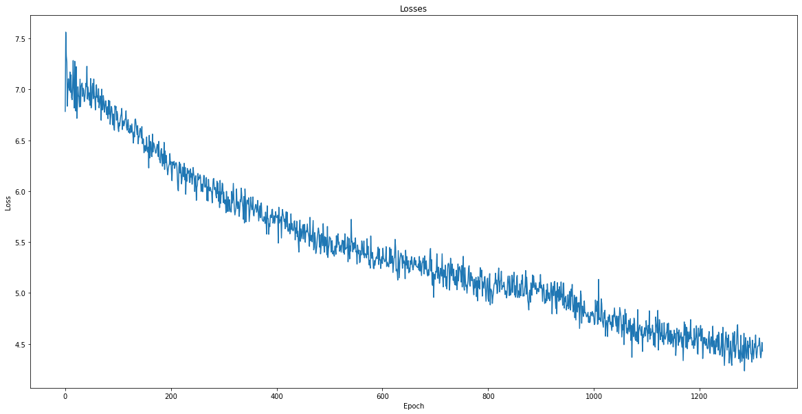

# CSE 490G1 Final Project: Text Summarization

## Abstract

In this project, I propose to use a deep learning model to automatically generate summaries of text documents. The limitation of extractive summarization approach (e.g. TextRank) has prompted me to implement a GRU-based encoder-decoder model. Through experiments, I have chosen the best hyperparameters such as learning rate, batch size, teaching forcing ratio, momentum, and weight decay for the model and trained it for more than 1000 epochs. To evaluate the performance, I used ROUGE score (f1-measure, precision, and recall). I also conducted thorough analysis of the existing problem of the model and propose several plans to develop a high-quality text summarizer in the future.

## Problem Statement

People's declining attention spans and willingness to read make it crucial to create concise summaries of significant news stories. To do this effectively, a good summarizer must not only select relevant words from the original text, but also create new grammatically correct phrases or sentences that accurately convey the main ideas of the article. A good summarizer can significantly reduce screening and reading time during research, ensuring most of the time is allocated for quality and relevant contents.

There are many different methods for summarizing text including extractive summarization and abstractive summarization.

- Extractive summarization involves selecting key phrases and sentences from the original text to create a summary. This method is based on the idea that the most important information in a piece of text can be found in its individual sentences and phrases. Some examples include sentence extraction, keyword extraction, Latent semantic analysis (with SVD), and TextRank.

- Abstractive summarization, on the other hand, uses deep learning algorithms to understand the meaning and context of the text, and then generate a summary that is written in the model's own words. It is more challenging as it requires the model to have a deep understanding of the text and be able to generate new text that accurately captures the main ideas of the original. Some examples models such as recurrent neural networks (RNNs) and transformers have gained a lot of attention in recent years.

In this project, I will explore different approaches to summarize a given texts.

## Related Work

Today, there are still a lot of active works and researches on text summarization. Most of the state-of-the-art works are seq2seq encoder-decoder architecture. The major trend is on Transformer, followed by LSTM, and RNN. The major benchline are mostly on GigaWord datasets/corpuses, and state-of-the art BART-RXF transformer in 2020 has achieved the greatest ROUGE-1 score of 40.45.

How a basic encoder-decoder architecture is summarized below:

- The encoder processes the input text and encodes it into a compact representation, called the context vector. This vector captures the most important information from the input text, such as the overall meaning and the relationships between different words or phrases.

- The decoder predicts the next word in the summary one at a time, based on the previous words in the summary and the context vector. It also uses an attention mechanism to focus on different parts of the input text at different times, allowing it to generate summaries that accurately capture the main ideas of the original text.

In this project, I implemented and trained an encoder-decoder model, with some additional preprocessing and optimization steps to improve my model. I use a Kaggle dataset [News Summary](https://www.kaggle.com/datasets/sunnysai12345/news-summary), which contains more than 4500 published articles from February to August 2017, with annotated headlines. I choose this dataset as its article length is shorter, hence reduces the complexity of training and also decreases the size of dataset. Most of the other dataset that I tried initially took a lot of unnecessary Colab time to just download/upload the dataset of GBs in size.

Take a peek at an example of the dataset:

Article:

> Saurav Kant, an alumnus of upGrad and IIIT-B's PG Program in Machine learning and Artificial Intelligence, was a Sr Systems Engineer at Infosys with almost 5 years of work experience. The program and upGrad's 360-degree career support helped him transition to a Data Scientist at Tech Mahindra with 90% salary hike. upGrad's Online Power Learning has powered 3 lakh+ careers.

Headline:

> upGrad learner switches to career in ML & Al with 90% salary hike

## Methodology

### TextRank

First, in order to improve my understanding on text summarization, I started with a non-deep-learning model - TextRank. TextRank is an algorithm for summarizing text that is based on the principles of graph-based ranking algorithm PageRank. TextRank constructs a graph of the text, with each sentence represented as a vertex in the graph. The edges between the vertices are determined by the similarity between the sentences, with sentences that are more similar having stronger edges. The TextRank algorithm then applies the PageRank algorithm to this graph to score each sentence. The sentences with the highest scores are selected as the summary of the text, with the number of sentences in the summary determined by the desired length of the summary. In my work, TextRank has been shown to produce high-quality summaries of text.

For example:

Input paragraphs (2016 characters):

> In an attempt to build an AI-ready workforce, Microsoft announced Intelligent Cloud Hub which has been launched to empower the next generation of students with AI-ready skills...

Output (650 characters):

> Envisioned as a three-year collaborative program, Intelligent Cloud Hub will support around 100 institutions with AI infrastructure, course content and curriculum, developer support, development tools and give students access to cloud and AI services. The company will provide AI development tools and Azure AI services such as Microsoft Cognitive Services, Bot Services and Azure Machine Learning. According to Manish Prakash, Country General Manager-PS, Health and Education, Microsoft India, said, "With AI being the defining technology of our time, it is transforming lives and industry and the jobs of tomorrow will require a different skillset.

However, the limitation of extractive summarization makes it hard to condense an article into a short news headline. Since it is an unsupervised learning algorithm, meaning that it does not use any labeled data or external knowledge to generate summaries. Instead, it relies on the structure of the text itself to identify important sentences and then produces a summary based on these sentences.

It also does not take into account the overall context or meaning of the text when generating summaries. This can lead to summaries that are incomplete or inaccurate, and do not accurately represent the original content. Additionally, TextRank is not able to incorporate any additional information or background knowledge that may be relevant to the text, which can further limit its ability to produce high-quality summaries.

TextRank is still a useful algorithm to create shorter paragraphs or extract keywords from a long article, but it is definitely not enough to be a good summarizer. Hence, I start to build an encoder-decoder model in Pytorch.

### Encoder-Decoder (GRU)

#### Preprocess

First, I use the following techniques to preprocess the data

1. Stopwords are common words that do not have much meaning on their own, such as "the," "a," and "and." These words are removed as they do not contribute much to the meaning of the text and can hinder the performance of the model.

2. Contraction mapping involves replacing contractions, such as "can't" and "won't," with their expanded forms, such as "cannot" and "will not." This can help improve the performance of the NLP model because contractions are often treated as separate words by the model, which can lead to incorrect predictions.

3. Removing punctuation involves removing punctuation marks from the text, such as commas, periods, and exclamation points. This can help the NLP model focus on the words in the text and their relationships, rather than being distracted by punctuation marks that do not contribute much to the meaning of the text.

4. Make all characters lowercase. This can make it easier to identify the unique words and count how many times each one appears despite their different capitalization in the document, even though it also creates some other problem (Is 'US' and 'us' the same?)

5. Replace all occurence of '. ' to ' . ' ensure that tokenization removes the EOS (End of statement) from its prepended ending words.

#### Vocabulary

Initially, I tried to implement the Dataset and Dataloader class but I couldnt't fix a diemnsionality error that keeps bugging me. Hence, I keep the data in memory as a list instead. This indeed makes the training and batch organization a bit harder, but I managed to translate them accordingly.

#### Final Model

This model involves two parts: RNNEncoder and Attention-based RNNDecoder.

```
EncoderRNN(
  (embedding): Embedding(100293, 300)
  (gru): GRU(300, 300)
)

AttnDecoderRNN(
  (embedding): Embedding(41363, 300)
  (attn): Linear(in_features=600, out_features=90, bias=True)
  (attn_combine): Linear(in_features=600, out_features=300, bias=True)
  (dropout): Dropout(p=0.1, inplace=False)
  (gru): GRU(300, 300)
  (out): Linear(in_features=300, out_features=41363, bias=True)
)
```

**Gated Recurrent Unit (GRU)**

According to my research, most of the related work prefer using LSTM/Bi-LSTM in text summarizer. However, my LSTM code does have some dimensionality error that took me two days of debugging, and with no good result. Hence, I decide to stick with just basic GRU first.

**Others**

I also use `F.softmax`, `nn.Linear`, `F.relu`, and `dropout = 0.1` are pretty standard.

#### Experiments and Hyperparamters

Most of my experiment is conducted by training the model for 60 epochs, which took about 30 minutes each. If there is a tie (final loss is similar), I will stick with the one that follows the industrial standard or reduces the training time. I decide not to look at other evaluation method like ROUGE score as there are no difference in them between models trained only for 60 epochs.

**Hidden Size**

I experiment with hidden size = 300, 600, and 900. I choose 300 as the other two options took much longer time to train for just a single epoch. Also, 600 and 900 seems to have greater loss after 60 epochs. (about 0.3 higher than 300) These bigger model, despite having greater potential, will need much longer time to become better and it is not realistic to train a good model within a few days using only Colab free GPU.

**Teaching Forcing**

The teaching forcing ratio is a hyperparameter that determines the extent to which the model should rely on the ground-truth input sequence when generating the next word in the sequence. When teaching forcing is applied, the model is given access to the ground-truth input sequence at each time step, and is expected to use this information to generate the next word in the sequence. This can help the model to stay on track and generate outputs that more closely match the ground-truth input.  I use a ratio of 0.5, which decreased the loss. Ratio lower than 0.3 seems to make the model diverge from learning.

**Momentum and Weight Decay**

I do not add any momentum and weight decay as my experiment shows that it only makes the model worse, despite with a lower learning rate than I chose. This might need more further investigation  in the future as I believe the momentum should only stabilize the model when the learning rate is lower.

**Batch Size and Learning Rate**

I choose a batch size of 256 and train the model at learning rate = 0.02 for 120 epochs, 0.01 for 840 epochs, and 0.005 for 360 epochs. Totally, I train the model for 1320 epochs (more than 15 hours on Colab across 4 days), where the model stops to progress and perform better after training.

## Results

### Inference Example

```
# Example 1
< Input: mumbai police booked owner manager motorbike shop jayna auto store borivali allegedly fleeing advance payment vehicles 60 people .  customers registered bikes diwali promised possession festival .  police suspect buyers collectively cheated 20 lakh .
= Ground Truth: mumbai motorbike shop owner booked cheating 60 people
> Generated: mumbai owner booked owner booked cheating cheating mumbai

# Example 2
< Input: lok sabha friday informed two lakh posts anganwadi workers helpers lying vacant across india .  1 . 09 lakh anganwadi worker positions vacant 1 . 18 lakh positions anganwadi helpers unoccupied mos women child development virendra kumar said .  53000 unoccupied positions bihar highest number vacant posts .
= Ground Truth: two lakh anganwadi posts lie vacant india wcd ministry
> Generated: two lakh workers india lakh workers india
```

This is the plot of the loss function across 1320 epochs.


The Final Rouge1 score (unigram) averaged over 1000 random samples:

```
Precision: 0.294
Recall: 0.285
f1_score: 0.287
```

Apparently, all evaluation methods that I try is showing that the final model is not doing that well.

The final loss is pretty high. The Rouge score is below what a standard summarizer can do too. Most importantly, the summary generated by the model in the example above are still unreadable, and often contains repeated/garbage words. It is still VERY VERY far from being a powerful summarizer like what a recent Hugging Face models or Chat-GPT can do.

## Conclusion

This model is way too basic to be a good summarizer. There are a couple of different approaches that I might want to try in the future, given that I have better GPU resources and time.

1. Fix the bugs that limit my model. I have several bugs in my code that stops me from using Dataset, Dataloader, and LSTM in my model. If I have more time, fixing them can definitely improve my model's training speed and complexity.

2. Use other loss function. Currently, my model is using `nn.NLLLoss`, which I realize might not be the best option out there pretty late. I think it worths to give `nn.CosineEmbeddingCriterion` or `L1HingeEmbeddingCriterion` as try as they might more suitable in NLP context. I might want to implement a custom criterion based on `Bleu` or `Rouge` score as well. A better loss function will be able to give better hint to the model during backward propagation.

3. Using a larger training dataset: A larger training dataset can provide the model with more examples to learn from, which can improve its accuracy. I have found a couple of larger datasets that might be handy for this approach, but might require a more stable GPU to train them instead of just using the Colab free GPU.

4. Fine-tuning the model's hyperparameters: The size of the hidden layers, can have a significant impact on its accuracy. I might want to increase the size of hidden layers so that the model has a better power to learn the texts better.

5. Use LSTM or other transformer architecture: They are more related to the recent work in text summarizer. I try to implement LSTM at first but to not avail. If I have more time, I will definitely give it a try and I believe it will yield a better model within shorter training time.

6. Ensembling multiple models: Combining the predictions of multiple models can improve the overall accuracy of the system. This can be done by training multiple models independently and then averaging their predictions, or by training a single model to combine the predictions of multiple sub-models.

7. Training the model for longer: Once I increase the size or complexity of model, the amount of time the model spends training can improve its accuracy by giving it more opportunities to learn from the data. In addition, I observe that even though the model stops to get a lower loss during training, training the model for longer duration does increase the likelihood of model to generate a better summary with random inputs.

## References

Suleiman, Dima, and Arafat Awajan. "Deep learning based abstractive text summarization: approaches, datasets, evaluation measures, and challenges." Mathematical problems in engineering 2020 (2020).

Shini, R. Subha, and VD Ambeth Kumar. "Recurrent Neural Network based Text Summarization Techniques by Word Sequence Generation." 2021 6th International Conference on Inventive Computation Technologies (ICICT). IEEE, 2021.

Lin, Chin-Yew, and F. J. Och. "Looking for a few good metrics: ROUGE and its evaluation." Ntcir workshop. 2004.

Mihalcea, Rada, and Paul Tarau. "Textrank: Bringing order into text." Proceedings of the 2004 conference on empirical methods in natural language processing. 2004.